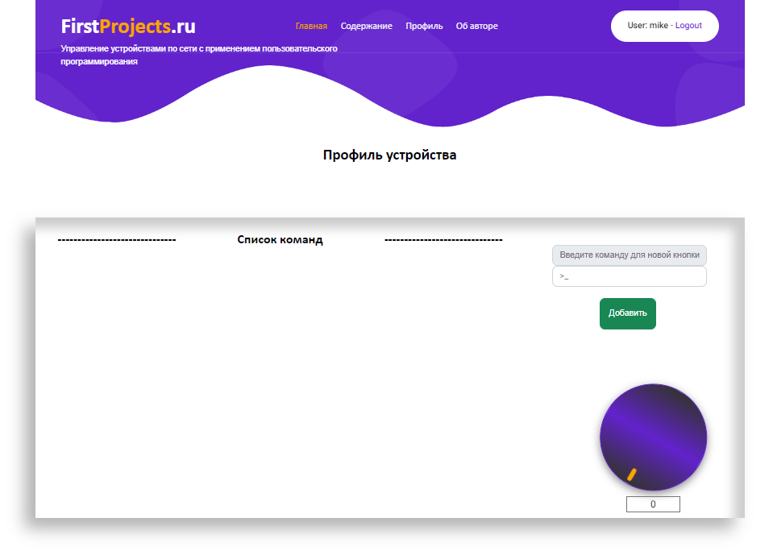
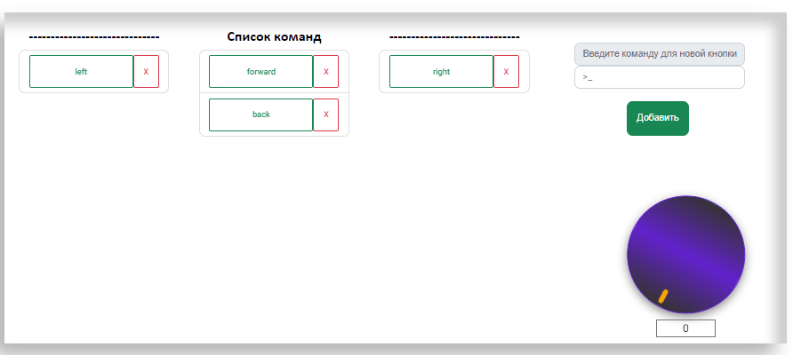
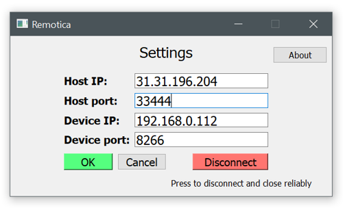
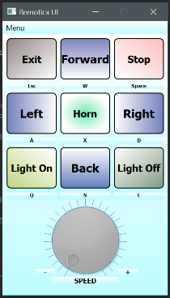
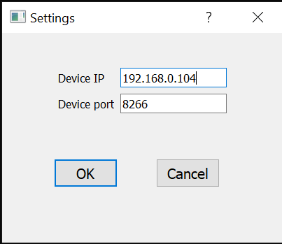
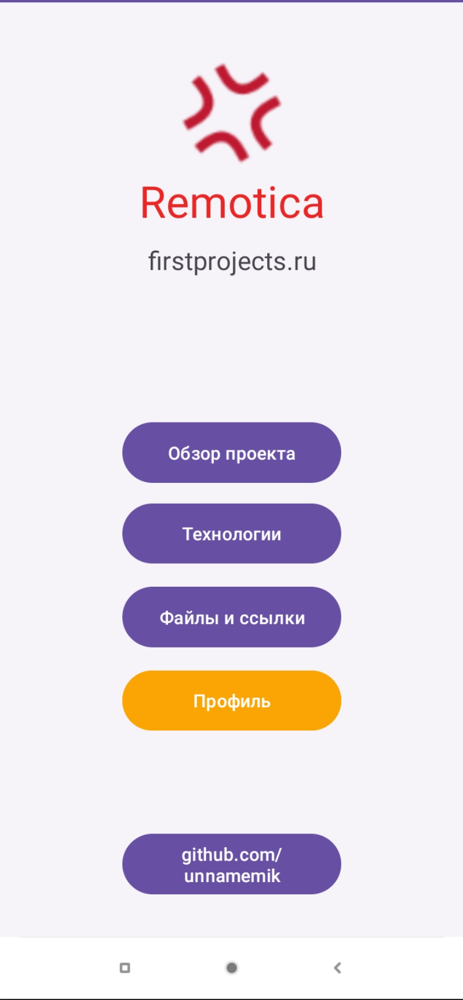
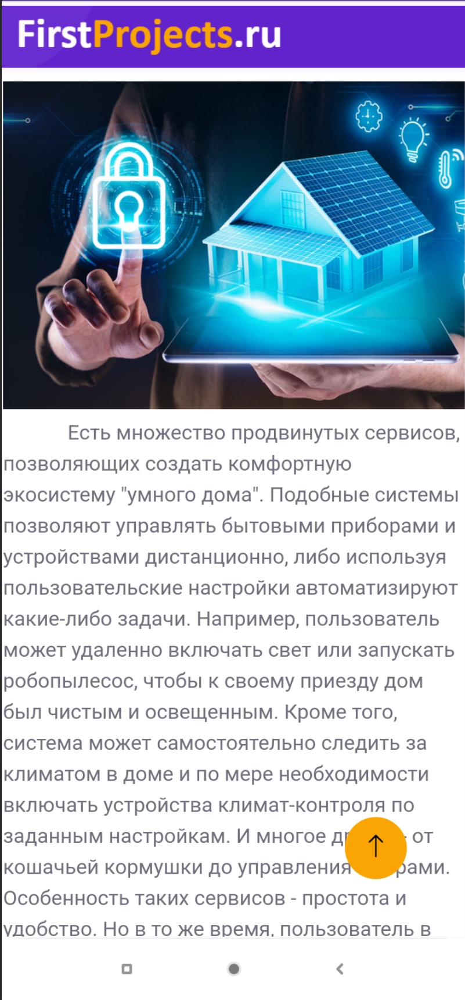
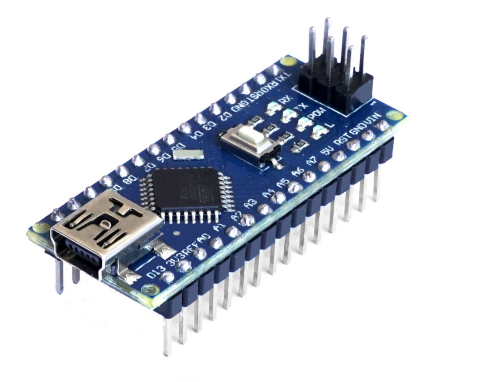
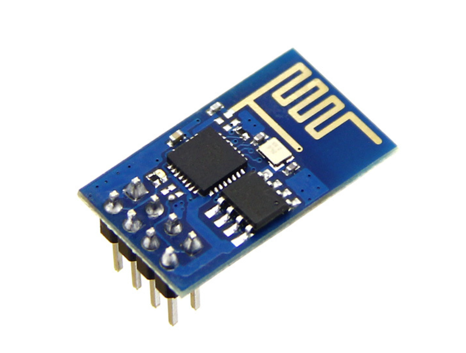

Руководство пользователя **Remotica**

Проект **Remotica** предназначен для создания собственного профиля
управления устройствами, которые будут подключаться посредством
модулей-драйверов. Все компоненты доступны на сайте по адресу
[[https://firstprojects.ru/diploma/files/]](https://firstprojects.ru/diploma/files/)
.

1.  Основной узел в этой системе -- сайт
    [[https://firstprojects.ru/]](https://firstprojects.ru/).

Авторизованный пользователь получает доступ к своей учетной записи, в
котором самостоятельно настраивает профиль удаленного устройства.

*Рис. 1 Профиль устройства*

В профиле устройства (Рис. 1) есть поле ввода для добавления команд и
поворотный регулятор. Команда представляет собой строку, логично
содержащую в себе исполняемый смысл -- например, команды forward, back,
left, right и т.д. Регулятор предназначен для отправки дискретных
значений по шкале от 0 до 255, которые на устройстве могут
конвертироваться в сигналы ШИМ. В поле под регулятором указано текущее
значение.

При добавлении команды появляется активный элемент, который содержит в
себе саму кнопку с командой и кнопку удаления. (Рис. 2) Эти элементы
можно размещать в поле списка команд, группируя по пользовательским
предпочтениям.

*Рис. 2 Список команд*

2.  Клиентское приложение Remotica Client Application (Remotica CA).

Предназначено для связи клиентской локальной сети с серверной частью.

*Рис. 3 Клиентское приложение*

В настройках клиентского приложения есть дефолтные поля IP адресов и
портов удаленного сервера и локального устройства (Рис. 3), которые
могут быть изменены в зависимости от конфигурации данных узлов. Скорее
всего потребуется изменить только адрес и IP устройства.

При нажатии кнопки **ОК** устанавливается соединение, о чем будет
выведено сообщение в строке состояния. Приложение сворачивается в трей и
работает в фоновом режиме. Для выхода из приложения следует нажать
**Disconnect** -- соединение прервется и приложение закроется.

3.  Приложение для управления устройством по локальной сети Remotica
    User Interface (Remotica UI).

Предназначено для связи c устройством по локальной сети при отсутствии
или без необходимости связи с серверной частью.

*Figure 4 Remotica UI*

В настройках указываются адрес и порт устройства, который можно найти в
веб-интерфейсе роутера.

После настройки связи устройство готово к использованию.

4.  Мобильное приложение.

Повторяет интерфейс сайта, адаптированный под мобильную версию. Также
как и в случае с сайтом, предварительно требуется запустить и настроить
клиентское приложение.

  -----------------------------------------------------------------------------------------------------------------------------------------------------------------------------------------------------------------------------------------------------------------------------------------------
  "   "      
Для указания собственных команд достаточно изменить строковые
переменные.

